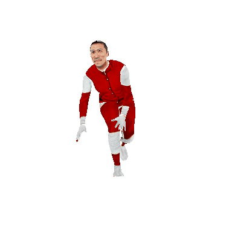
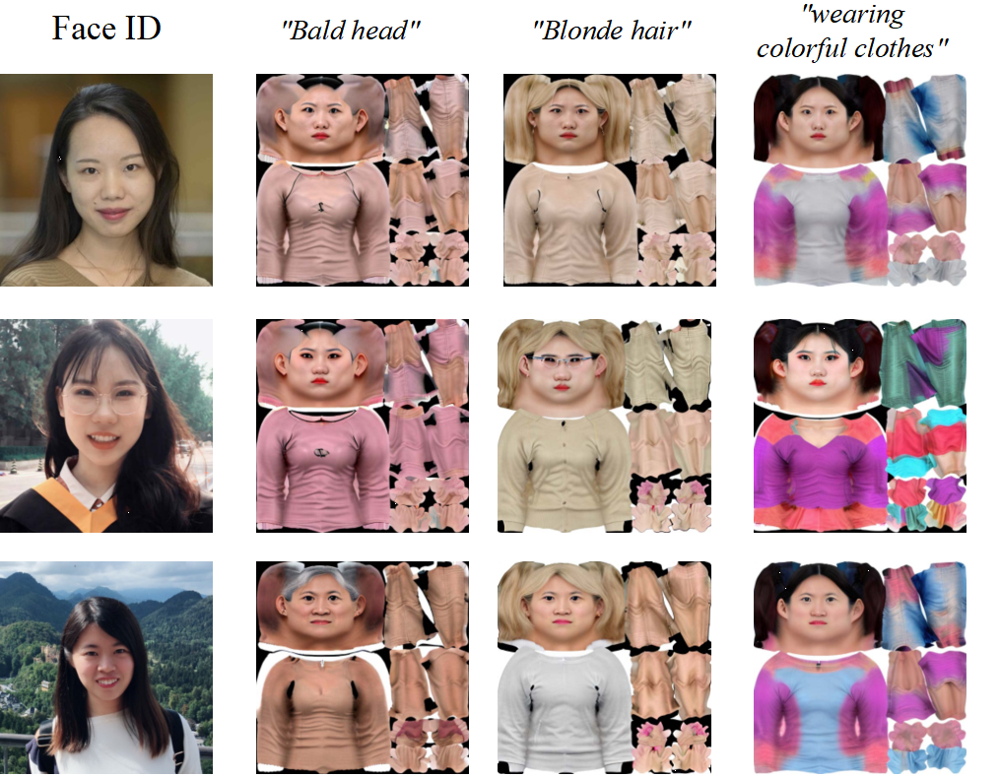

# UVMap-ID: A Controllable and Personalized UV Map Generative Model
## [Paper](https://arxiv.org/abs/2404.14568) | [Video Youtube](https://www.youtube.com/watch?v=KCHUWPtBe9o)

 
 
 
 

## Results

 
 
 

## Rendering

 |  |  

